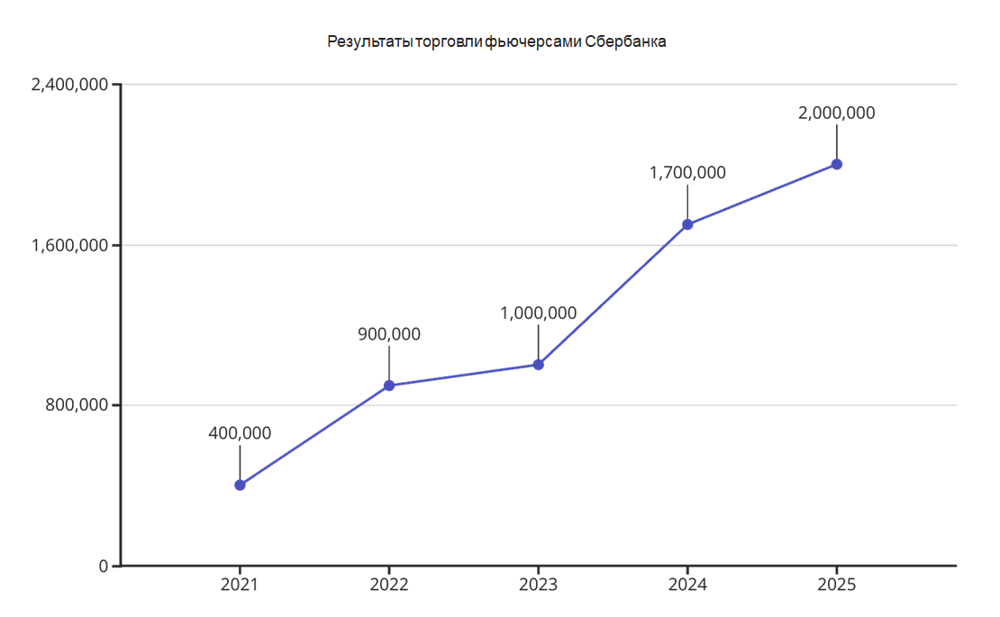
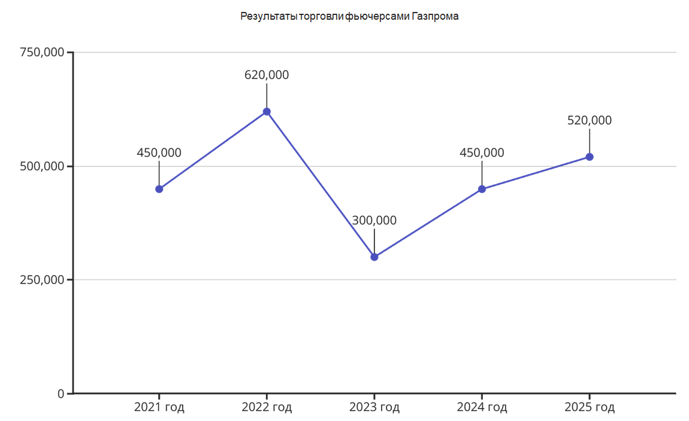

# ZRSIMACD (modular) — RSI/MACD утилиты и сбор котировок

Репозиторий упакован в пакет со структурой `src/`. Все старые скрипты сохранены и доступны как подкоманды CLI.

## Установка (локально)
```bash
python -m venv .venv && source .venv/bin/activate  # Windows: .venv\Scripts\activate
pip install -U pip
pip install -e .
cp .env.example .env  # заполните TINKOFF_TOKEN
mkdir -p data && cp src/zrsimacd/scripts/../..//data/tickers.txt.example data/tickers.txt 2>/dev/null || true
```

## Использование
```bash
# Загрузка свечей через Tinkoff
zrsimacd fetch

# Работа с фьючерсами
zrsimacd futures

# Расчёт индикаторов по CSV
zrsimacd indicators

# Финальный анализ RSI/MACD
zrsimacd analyze

# Отчёты по трейдам
zrsimacd report
```

Любые аргументы после подкоманды пробрасываются в оригинальный скрипт, например:
```bash
zrsimacd fetch --help
```

## Структура
- `src/zrsimacd/scripts/` — первичные скрипты (без переписывания логики).
- `src/zrsimacd/cli.py` — единая точка входа (CLI).
- `.env.example` — задаёт `TINKOFF_TOKEN`, `TICKERS_FILE` и пр.
- `pyproject.toml` — метаданные и зависимости.


## 📂 Путь для данных

- **Список тикеров** — файл `data/tickers.txt` (каждый тикер на новой строке, пример в `data/tickers.txt.example`).
- **Токен Tinkoff Invest API** — храните в `.env` (`TINKOFF_TOKEN=...`) или в `token.txt` (не рекомендуется).
- **Котировки** — после выполнения команды `zrsimacd fetch` будут сохранены в папке `SBERBANK_FUTURES/` в корне проекта.  
  Внутри будет структура по интервалам из `INTERVALS` (например: `SBERBANK_FUTURES/4_hour/SBER.csv`).

**Пример структуры:**
```
SBERBANK_FUTURES/
└── 4_hour/
    ├── SBER.csv
    ├── GAZP.csv
    └── ...
```

## 📊 Результаты бэктестов

### Фьючерсы Сбербанка (4Q 2020 — 2Q 2025)
- **Общее количество сделок:** 284  
- **Начальный баланс:** 500 000 ₽  
- **Итоговый баланс:** ~1 962 000 ₽  
- **Среднегодовая прибыль:** ~65% (325 000 ₽)  
- **Максимальная прибыль:** 2022 год, ~107% годовых (535 000 ₽)  



---

### Фьючерсы Газпрома (1Q 2021 — 2Q 2025)
- **Общее количество сделок:** 250  
- **Начальный баланс:** 500 000 ₽  
- **Итоговый баланс:** ~527 000 ₽  
- **Среднегодовая прибыль в прибыльные годы:** ~26% (130 000 ₽)  
- **Худший год:** 2022, убыток ~320 000 ₽  



---

📌 **Примечание:** стратегия тестировалась на исторических данных с применением комиссий брокера, торговля велась на весь капитал в сделке.  
Графики отражают динамику роста/снижения баланса по годам.

## Лицензия
MIT
